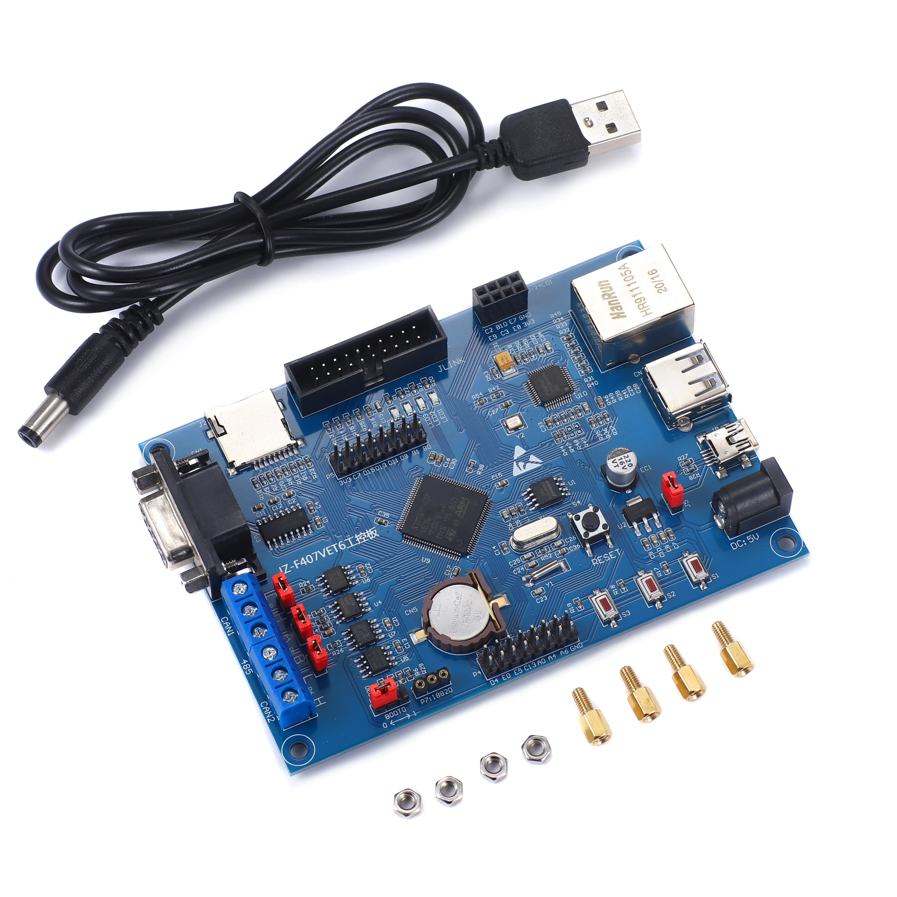

# JZ-STM32F407VET6

## [Schematic](Documents/JZ_STM32F407VET6.pdf)

## Product Introduction
  - The development board uses the STM32F407VET6
    chip as the main control Controller, M4 super core,
    expansion with one RS232 interface, one RS485 interface,
    two CAN interfaces, one Ethernet Interface, one USB HOST
    interface, one USB DEVICE Interface, three user buttons,
    three user indicators. non- Often suitable for loT
    application development, gateway server
    development, Bus communication development
    and industrial control.

## Product parameter
  - Master MCU STM32F407VET6-LQFP100
  - Ethernet chip DP83848-LQFP48
  - One serial port (RS232) interface with pins (PA9 PA10)
  - Two RS485 interfaces with pins (PD5 PD6)
  - Two CAN interfaces with pins (PDO PD1)/(PB5 PB6)
  - TF card 9-pin small card, controlled by the PC and PD pins
  - Wireless interface P3 leads to NRF24L01 interface
  - USB interface One master USB and one slave USB
  - Storage Built-in 24C02 and 25Q64 memory chips
  - Single-wire temperature sensor interface for DS18B20
  - JTAG interface corresponding to JLINK
  - Three user buttons
  - Three user indicators

* Taken from the seller's [link](https://aliexpress.ru/item/1005001620616382.html?spm=a2g2w.orderdetails.0.0.50d54aa6zDKifv&sku_id=12000016843280467&_ga=2.216905941.251859802.1667914724-693672806.1659628089)
